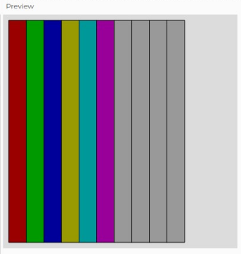

# GB&C December 2022 - AV Club Vol. 1 // Generative Art
## Description

At @wmde, in December 2022 some employees participated in the Ginger Beer & Cake 24h hackathon and gathered to explore creating generative art with code.

This project was called `AV Club Vol. 1 // Generative Art`.

We created different sketches with Processing and p5js, [recreated the Wikidata logo in code](/p5js/wikidata-logo-static.js) and animated it with different methods (audio input & midi note input).

## Showcase
### [Audio input #1](/p5js/wikidata-logo-audio-input-1.js)
- live demo: https://editor.p5js.org/ledeniz/sketches/ZpHMcj8Ni

### [Audio input #2](/p5js/wikidata-logo-audio-input-2.js)
- live demo: https://editor.p5js.org/ledeniz/sketches/8i0pZqwBh

### [Random colors](/processing/wikidata_logo_colors/wikidata_logo_colors.pde)

### [MIDI note input](/processing/wikidata_logo_midi/wikidata_logo_midi.pde)

There are also 2 Processing sketches in this repository created by ChatGPT. We will never forget it's attempt at creating the wikidata logo (only this screenshot is left of it):

## notes
### tools
- https://processing.org/ (Java, native) (4.1.1)
  - https://github.com/sparks/themidibus
- https://p5js.org/ (JS, browser)

### inspiration
- https://processing.org/examples
- https://p5js.org/examples/
- https://old.reddit.com/r/generative/
- https://old.reddit.com/r/processing/

Participants: Deniz Erdogan, Annie Kim and 2 other creative WMDE employees.